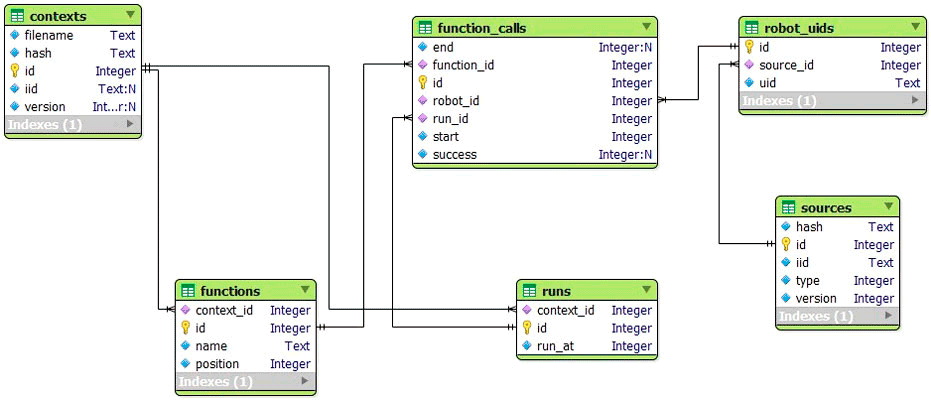

# RCML - Документация для разработчиков

- [1. Содание собственных модулей для языка RCML](#1-Создание-собственных-модулей-для-языка-rcml)
	- [1.1 Модуль робота](#11-Модуль-робота)
		- [1.1.1 API библиотеки модуля робота](#111-api-библиотеки-модуля-робота)
		- [1.1.2 API модуля робота](#112-api-модуля-робота)
			- [1.1.2.1 Метод getModuleInfo](#1121-Метод-getmoduleinfo)
			- [1.1.2.2 Метод prepare](#1122-Метод-prepare)
			- [1.1.2.3 Метод getFunctions](#1123-Метод-getfunctions)
			- [1.1.2.4 Метод getAxis](#1124-Метод-getaxis)
			- [1.1.2.5 Метод writePC](#1125-Метод-writepc)
			- [1.1.2.6 Метод init](#1126-Метод-init)
			- [1.1.2.7 Метод final](#1127-Метод-final)
			- [1.1.2.8 Метод readPC](#1128-Метод-readpc)
			- [1.1.2.9 Метод startProgram](#1129-Метод-startprogram)
			- [1.1.2.10 Метод getAviableRobots](#11210-Метод-getaviablerobots)
			- [1.1.2.11 Метод robotRequire](#11211-Метод-robotrequire)
			- [1.1.2.12 Метод robotFree](#11212-Метод-robotfree)
			- [1.1.2.13 Метод endProgram](#11213-Метод-endprogram)
			- [1.1.2.14 Метод destroy](#11214-Метод-destroy)
		- [1.1.3 API робота](#113-api-робота)
			- [1.1.3.1 Метод prepare](#1131-Метод-prepare)
			- [1.1.3.2 Метод getUniqName](#1132-Метод-getuniqname)
			- [1.1.3.3 Метод executeFunction](#1133-Метод-executefunction)
			- [1.1.3.4 Метод axisControl](#1134-Метод-axiscontrol)
	- [1.2 Модуль функций](#12-Модуль-функций)
		- [1.2.1 API библиотеки модуля функций](#121-api-библиотеки-модуля-функций)
		- [1.2.2 API модуля функций](#122-api-модуля-функций)
	- [1.3 Модуль управления](#13-Модуль-управления)
		- [1.3.1 API библиотеки модуля управления](#131-api-библиотеки-модуля-управления)
		- [1.3.2 API модуля управления](#132-api-модуля-управления)
		- [1.3.3 Метод execute](#133-Метод-execute)
	- [1.4 Модуль выбора робота](#14-Модуль-выбора-робота)
		- [1.4.1 API библиотеки модуля выбора робота](#141-api-библиотеки-модуля-выбора-робота)
		- [1.4.2 API модуля выбора робота](#142-api-модуля-выбора-робота)
		- [1.4.3 Метод makeChoice](#143-Метод-makechoice)
- [2. Об интерфейсных идентификаторах применительно к модулямъ(#2-Об-интерфейсных-идентификаторах-применительно-к-модулям)
- [3. Работа с RCML статистикой](#3-Работа-с-rcml-статистикой)
	- [3.1 Общие сведения и рекомендации](#31-Общие-сведения-и-рекомендации)
	- [3.2 Структура базы данных статистики](#32-Структура-базы-данных-статистики)

# 1 Создание собственных модулей для языка RCML

Все заголовочные файлы, описания по которым приводятся в данном разделе, на языке программирования С++ можно найти в соответствующем официальном репозитории [module_headers](https://github.com/rcml-tech/module_headers) в сервисе GitHub.

Все типы модулей в среде *RCML* создаются посредством динамически подключаемых библиотек (*dll* файлы для ОС семейства *Windows*, или *so* файлы для ОС семейства *Linux*), через них реализуются различные API взаимодействия с роботом, которые описаны ниже.

Унификация интерфейса взаимодействия на программном уровне дает разработчику преимущества в выборе аппаратных интерфейсов, аппаратных средств, способах связи, технологиях и т.д. при решении задачи интеграции своих решений со средой *RCML*.

Нижеизложенные инструкции будут даваться применительно к языку программирования С++, однако можно использовать любые другие языки программирования для создания модулей, важно, чтобы динамически подключаемые библиотеки предоставляли определенные интерфейсы, такие же, через которые  это было бы сделано на С++.

Библиотека модуля, независимо от типа модуля, должна экспортировать всего две функции:

- функцию, возвращающую версию API поддерживаемого модулем;
- функцию, возвращающую указатель на потомка абстрактного класса соответствующего типа модуля.

Однако имена этих функций, как и возвращаемый результат, зависят от типа модуля. Данные функции не принимают параметров, и их имена должны быть строго определенными.

Вызов данных функций происходит единожды при старте компилятора или интерпретатора. Соответственно гарантируется, что объект, указатель на который возвращает данная функция, будет всегда в единственном числе в рамках одного экземпляра среды *RCML*.

**Важно!** Следует помнить, что возможна работа одновременно нескольких экземпляров интерпретаторов и/или компиляторов, решающих разные задачи, поэтому каждый экземпляр будет вызовать функции из файла модуля, и, соответственно, критические методы отвечающие за работу с оборудованием, такие как *init, final, destroy* и другие в процессе своей работы. Причем, учитывая нюансы многопоточности, следует отметить, что их вызов может быть одновременным по времени.

**Важно!** Также следует помнить что при работе компилятора методы модулей вызываются из одного и того же потока, т.к. компилятор однопоточен. При работе интерпретатора методы модулей могут вызывается из разных потоков в произвольные моменты времени, а не строго последовательно.

**Поэтому все модули работающие с оборудованием должны быть потокобезопасными во всех отношениях!**

При реализации модуля робота рекомендуется применить паттерн проектирования *singletone*, учитывая, что обращения к методам модуля робота может быть из разных потоков и даже одновременно.

## 1.1 Модуль робота

Как отмечалось ранее, чтобы иметь возможность передачи реальному физическому роботу команд посредством языка *RCML*, нужно, чтобы этот робот был представлен в среде *RCML* посредством модуля робота.

### 1.1.1 API библиотеки модуля робота

Библиотека модуля робота должна экспортировать следующие функции:
```
unsigned short getRobotModuleApiVersion();
RobotModule* getRobotModuleObject();
```
Функция *getRobotModuleApiVersion* возвращает в виде положительного целого числа версию используемого *API* модуля робота в данном конкретном модуле. Лучше всего определить данную функцию следующим кодом:
```
unsigned short getRobotModuleApiVersion() { return ROBOT_MODULE_API_VERSION; }
```
Константа *MODULE_API_VERSION* определена в подключаемом файле *module.h*, который необходим при компиляции модуля робота. Таким образом можно не заботиться о проставлении версии вручную, и она будет соответствовать используемому интерфейсу модуля.

Функция *getRobotModuleObject* возвращает указатель на объект абстрактного класса *RobotModule*, по сути описывающего необходимый интерфейс модуля робота.

Далее под абстрактным роботом модуля будет пониматься класс *RobotModule*, соответственно, класс, на который указывает возвращаемый указатель, должен быть унаследован от него (абстрактного модуля робота) и переопределять все виртуальные методы данного класса, сохраняя режим обращения к ним. Данный дочерний класс далее будет упоминаться как модуль робота.

### 1.1.2 API модуля робота

Определение класса *RobotModule* на языке *C++*:
```
class RobotModule {
 protected:
  RobotModule() {}

 public:
  // init
  virtual const struct ModuleInfo& getModuleInfo() = 0;
  virtual void prepare(colorPrintfModule_t *colorPrintf_p,
                       colorPrintfModuleVA_t *colorPrintfVA_p) = 0;

  // compiler only
  virtual FunctionData **getFunctions(unsigned int *count_functions) = 0;
  virtual AxisData **getAxis(unsigned int *count_axis) = 0;
  virtual void *writePC(unsigned int *buffer_length) = 0;

  // intepreter - devices
  virtual int init(initCallback_t& initCallback) = 0;
  virtual void final() = 0;

  // intepreter - program & lib
  virtual int readPC(int pc_index, void *buffer, unsigned int buffer_length) = 0;

  // intepreter - program
  virtual int startProgram(int run_index, int pc_index) = 0;
  virtual AviableRobotsResult *getAviableRobots(int run_index) = 0;
  virtual Robot *robotRequire(int run_index, Robot *robot) = 0;
  virtual void robotFree(int run_index, Robot *robot) = 0;
  virtual int endProgram(int run_index) = 0;

  // destructor
  virtual void destroy() = 0;
  virtual ~RobotModule() {}
};
```

#### 1.1.2.1 Метод getModuleInfo

Метод *getModuleInfo* должен возвращать структуру *ModuleInfo* описывающую данный модуль. Данный метод может вызываться множество раз за один сеанс работы.

Определение структуры *ModuleInfo*, описывающей модуль:
```
struct ModuleInfo {
  char *iid;
  enum Modes { PROD, SPEC } mode;
  unsigned short version;
  char *digest;
};
```
В данной структуре обозначены следующие элементы:

- *iid* – идентификатор интерфейса данного модуля. Данная строка не должна быть длиннее 32 байт. Подробнее см. раздел ["Подробнее об интерфейсных идентификаторах"](http://docs.rcml.tech/#13).
- *mode* – тип версии данного файла модуля, может быть *PROD* – промышленное («продакшен») исполнение, или *SPEC* – спецификационное исполнение. Промышленное исполнение предполагает полноценный файл модуля, декларирующий функции модуля и содержащий код для их выполнения. Спецификационное исполнение предполагает, что файл модуля только декларирует функции модуля в среде *RCML*, но не имеет в себе кода для их выполнения. Соответственно, промышленный вариант исполнения модуля может быть использован и для компиляции программ на *RCML* с данным модулем, и для их исполнения, а спецификационный вариант исполнения может быть использован только для компиляции. Интерпретатор не будет работать со спецификационным исполнением модуля. Данный механизм позволяет разработчикам модулей роботов декларировать интерфейс модуля робота, не передавая его основной код. Это может быть полезно при работе с подрядчиками, пишущими ПО под данный модуль. Они могут иметь средства проверки правильности использования интерфейса, но не будут иметь возможности получения реального модуля.
- *version* – отражает текущую версию модуля в виде целого положительного числа, если модуль не планируется распространять через сервис Репозиторий, то данное поле не играет большой роли. Однако в противном случае нужно учитывать тот факт, что Репозиторий требует, чтобы очередная версия загружаемого модуля была выше загруженной ранее.
- *digest* – указатель на цифровую подпись разработчика модуля, используется только сервисом Репозиторий.


#### 1.1.2.2 Метод prepare

Метод *prepare* вызывается единожды сразу после загрузки модуля в память, в качестве параметров этого метода передаются два указателя на системные функции среды *RCML*, позволяющие модулю производить логируемый вывод различных данных. Вывод через данные процедуры отправляется в стандартный вывод и может быть отформатирован и записан в соответствующие лог файлы среды *RCML*.

Функции, на которые передаются указатели, описаны в *module.h* и имеют следующее определение:
```
void colorPrintfFromModuleVA(void *module, ConsoleColor colors, const char *mask, va_list args);
void colorPrintfFromModule(void *module, ConsoleColor colors, const char *mask,...);
```
В качестве параметра *module* должен быть передан указатель на текущий экземпляр модуля робота, т.е. *this*. В качестве параметра *colors* должна быть передана структура *ConsoleColor*, этот параметр задает цвет вывода в консоли. Третий параметр *mask* задает маску форматирования, по аналогии с функцией *printf* из стандартной библиотеки *C++*. Далее в зависимости от функции вывода, согласно заданной маске форматирования, следует обычное перечисление параметров или перечисление параметров в виде структуры *va_list* из *std_arg.h*.

#### 1.1.2.3 Метод getFunctions

Метод *getFunctions* вызывается только компилятором, должен возвращать указатель на массив указателей на структуры *FunctionData*, описывающие каждую доступную функцию робота. Причем данный метод принимает по ссылке один параметр *count_functions*, в который должно быть записано количество элементов массива с указателями на *FunctionData*, подробнее см. ниже. В случае если модуль робота не предоставляет никаких функций, то данный метод должен вернуть *NULL* в качестве указателя, а в параметр *count_functions* записать 0.

Структура *FunctionData*, служит для описания каждой функции робота доступной для использования в языке *RCML*. Определение структуры на языке *C++*:
```
struct FunctionData {
  enum ParamTypes { STRING, FLOAT };

  system_value command_index;
  unsigned int count_params;
  ParamTypes *params;
  const char *name;
  FunctionData() : command_index(0), count_params(0), params(NULL), name(NULL) {}
  FunctionData(system_value command_index, system_value count_params, ParamTypes *params, const char *name) : command_index(command_index), count_params(count_params), params(params), name(name) {}
};
```
В данной структуре обозначены следующие элементы:

- *command_index* – уникальный идентификатор команды в рамках модуля, данное значение будет в дальнейшем использоваться и передаваться представлению робота интерпретатором, чтобы указать, какую команду должен выполнить конкретный робот. Идентификатор команды должен быть целым числом больше нуля, значение нуля и отрицательные значения зарезервированы и являются системными;
- *count_params* – количество параметров функции, равное количеству элементов в массиве *params*;
- *params* – указатель на массив типов параметров, каждый элемент массива должен быть представлен элементом перечисления *ParamTypes: STRING* – строка или *FLOAT* – число. Детальное описание механизма передачи параметров см. ниже;
- *name* – указатель на имя функции, которое должен будет указать программист на языке *RCML*, чтобы вызвать данную функцию.


#### 1.1.2.4 Метод getAxis
Метод *getAxis* также вызывается только компилятором, должен возвращать указатель на массив указателей на структуры *AxisData*, описывающие каждую доступную ось управления робота для режима ручного управления. Данный метод, по аналогии с предыдущим, принимает по ссылке один параметр *count_axis*, в который должно быть записано количество элементов массива с указателями на *AxisData*, подробнее см. ниже. В случае если модуль робота не поддерживает режима ручного управления, данный метод должен вернуть *NULL* в качестве указателя, а в параметр *count_axis* записать 0.

Определение структуры *AxisData*:
```
struct AxisData {
  system_value axis_index;
  variable_value upper_value;
  variable_value lower_value;
  const char *name;
  AxisData() : axis_index(0), upper_value(0), lower_value(0), name(NULL) {}
  AxisData(system_value axis_index, variable_value upper_value, variable_value lower_value, const char *name) : axis_index(axis_index), upper_value(upper_value), lower_value(lower_value), name(name) {}
};
```
В данной структуре обозначены следующие элементы:

- *axis_index* – уникальный идентификатор оси в рамках модуля, данное значение будет в дальнейшем использоваться и передаваться представлению робота интерпретатором, чтобы указать значение какой оси нужно изменить. По аналогии с уникальными идентификаторами команд робота, идентификатор оси должен быть целым числом больше нуля;
- *upper_value* – верхнее граничное значение, которое можно передать для данной оси;
- *lower_value* –нижнее граничное значение, которое можно передать для данной оси;
- *name* – указатель на имя оси, которое должен будет указать программист на языке *RCML* в вызове системной функции *hand_control*, чтобы связать данную ось.

#### 1.1.2.5 Метод writePC
Метод *writePC* вызывается только компилятором, данный метод позволяет записать модулю в файл компилируемой программы произвольные данные, указатель на область которых должен быть возвращён методом в качестве результата, а длина данных записана в параметр *buffer_length*, передаваемый по ссылке.

#### 1.1.2.6 Метод init
Метод *init* служит для выполнения модулем робота процедур, необходимых для корректного начала работы, например, чтение файла настроек, установка связи с роботами и т.д. Метод вызывается только интерпретатором единожды в начале работы, после вызова метода *prepare*. Данный метод должен вернуть значение 0, если при загрузке не возникло ошибок и вызывающая среда может продолжить работу. В противном случае любое другое значение, отличное от 0, и вызывающая программа, соответственно, завершит работу с выводом ошибки о невозможности проинициализировать данный модуль. Метод принимает один параметр - указатель на функцию *initCallback*. Данную функция необходима только для лицензируемых модулей с ограничением распространения.

Определение функции *initCallback* следующее:
```
const RobotInfoResult* initCallback(unsigned size, const RobotInfo robots[]);
```
Первый параметр *size* - размер массива структур *RobotInfo*, ссылка на который передается во втором параметре *robots*. 

Структура *RobotInfo* имеет определение:
```
struct RobotInfo {
  const char* uniqueName;
  const char* serialNumber;
};
```
Данная структура описывает каждого подключенного к модулю робота и состоит всего из двух свойств:
- *uniqueName* - указатель на строку - уникальное имя робота, которое используется только при отображении сообщений применительно к этому роботу (для упрощения идентификации робота);
- *serialNumber* - указатель на строку - серийный номер робота.

Функция *initCallback* производит сопоставление серийных номеров роботов, с теми которые указаны в текущей лицензии на RCML и возвращает указатель на структуру *RobotInfoResult*.

Структура *RobotInfoResult*:
```
struct RobotInfoResult {
  const bool* serialNumbers;
  const char* signature;
};
```
Значения *True* в булевом массиве *serialNumbers* указывают на серийные номера прошедшие верификацию. Порядковый номер элемента со значением *True*, равен порядковому номеру структуры *RobotInfo*, содержащей серийный номер прошедший верификацию. Свойство *signature* содержит указатель на цифровую подпись RCML для данного модуля.

#### 1.1.2.7 Метод final
Метод *final* служит для выполнения модулем робота процедур, необходимых для корректного окончания работы, например, сохранение каких-то промежуточных значений, выключение роботов и т.д. Данный метод, как и метод *init*, вызывается только интерпретатором единожды при завершении выполнения основной программы.

#### 1.1.2.8 Метод readPC
Метод *readPC* вызывается только интерпретатором при загрузке очередной программы или библиотеки в память, если в ней имеются данные записанные данным модулем, то в параметре *buffer* будет передан указатель на область этих данных, а в параметре *buffer_length* будет передан размер этих данных. В параметре *pc_index* указывается уникальный индекс загружаемого *PCode* файла (этот индекс используется в других методах, см. далее). Если данных записанных модулем в программе нет, то данный метод не будет вызван. Метод *readPC* должен вернуть 0, если можно начать выполнение загружаемого файла или значение отличное от 0, если загружаемый файл выполнять нельзя. В последнем случае работа RCML будет остановлена с ошибкой. Данный прием обычно используется для хранения настроек модуля в *PCode* файле и проверки соответсвия текущей среды сохранненной конфигурации.

#### 1.1.2.9 Метод startProgram

Метод *startProgram* вызывается только интерпретатором перед началом выполнения очередной программы на языке *RCML*, в качестве параметра *run_index* будет передано уникальное число – идентификатор запуска программы, а в параметре *pc_index* уникальный индекс загруженного *PCode* файла, из которого выполняется программа. Файл может быть загружен единожды, но программа в нем может запускаться на выполнение несколько раз подряд и даже в параллельном исполнении. В случае если данный метод возвращает значение 0, данная программа будет передана на выполнение. В противном случае, получая любое другое значение, отличное от 0, среда *RCML* не будет выполнять данную программу и выдаст ошибку с сообщением о том, что данный модуль запрещает запуск текущей *RCML* программы. Данный метод позволяет запретить выполнение программы на основе данных полученных в методе *readPC*.

#### 1.1.2.10 Метод getAviableRobots

Данный метод вызывается при задействовании робота с учетом модуля выбора. Задача данного метода - предоставить информацию о свободных роботах модулям выбора, чтобы те соответсвенно могли произвести выбор робота.
Метод *getAviableRobots* возвращает указатель на структуру *AviableRobotsResult* содержащую в себе информацию о всех свободных роботах данного модуля на момент запроса. 

Определение структуры *AviableRobotsResult*, описывающей список свободных роботов:
```
struct AviableRobotsResult {
  Robot **robots;
  unsigned int count_robots;
  AviableRobotsResult(Robot **robots, unsigned int count_robots) : robots(robots), count_robots(count_robots) {}
  void destroy() { delete this; }
  ~AviableRobotsResult() { delete[] robots; }
};
```
Свойства структуры:
- *robots* – массив указателей на свободных роботов;
- *count_robots* – количество элементов в массиве *robots*.

#### 1.1.2.11 Метод robotRequire
Метод *robotRequire* вызывается при задействовании конкретного робота выбранного модулем выбора, либо при задействовании робота без модуля выбора. 

В первом случае в параметре *robot* указывается указатель, полученный ранее от метода *getAviableRobots*, на конкретного робота. Модуль робота должен проверить, что запрашиваемый робот свободен, и если это действительно так, задействовать запрашиваемого робота и вернуть указатель на него, в противном случае вернуть *NULL*, что означает что данный робот не может быть задействован. 

Во втором случае параметр *robot* будет равен *NULL*, и модуль робота может вернуть любого свободного робота или *NULL* если свободных роботов нет.

**Важно!** Следует отметить, что данный метод не должен задерживать выполнение с целью ожидания освобождения робота, это будет сделано внутренними механизмами среды *RCML*.

#### 1.1.2.12 Метод robotFree
Метод *robotFree* вызывается только интерпретатором, когда конкретный задействованный робот перестал быть нужным конкретной программе и его можно освободить. В качестве параметра будет передан указатель, который был получен ранее от метода *robotRequire*. Гарантируется, что данный указатель не будет изменен в процессе выполнения программы.

#### 1.1.2.13 Метод endProgram
Метод *endProgram* также вызывается только интерпретатором после завершения выполнения программы на *RCML*, в качестве параметра *run_index* будет передан тот же самый идентификатор запуска программы, характеризующий данную программу, который был передан при вызове метода *startProgram*. В случае если данный метод возвращает значение 0, считается, что данная программа отработала без ошибок, и код её завершения изменен не будет. При возвращении любого другого числа считается, что программа отработала с ошибками, и код её завершения будет отличным от 0. Данный метод позволяет модулю при завершении программы сообщить, что работа данной программы с данным модулем не была корректна и в ходе её работы были ошибки.

#### 1.1.2.14 Метод destroy
Метод *destroy* является алиасом деструктора модуля робота, в нём должен происходить вызов деструктора объекта модуля робота, если это необходимо, и освобождение занятых ресурсов, так как среда *RCML* не вызывает метод деструктора из-за особенностей работы кода, созданного различными компиляторами. Данный метод вызывается компилятором и интерпретатором единожды при завершении работы, перед тем как будет выгружен модуль из памяти конкретным экземпляром интерпретатора или компилятора (через вызов функции *FreeLibrary*).

### 1.1.3 API робота

Далее под классом, на экземпляр которого возвращается указатель методом *robotRequire* модуля робота, будет пониматься представление робота, причем этот класс должен быть унаследован от абстрактного класса *Robot*, далее именуемый как абстрактное представление робота. По сути, экземпляр представления робота является тем самым представлением физического робота в среде *RCML*, которое упоминалось при описании синтаксиса языка и через которое происходит взаимодействие среды *RCML* и реального конкретного робота. Представление робота должно реализовывать все публичные методы абстрактного представления робота.

Т.к. с конкретными роботами работает только *RCML* интерпритатор, все методы класса *Robot* вызываются только им.

Определение класса *Robot* на языке *C++*:
```
class Robot {
 protected:
  Robot() {}

 public:
  virtual void prepare(colorPrintfRobot_t *colorPrintf_p,
                       colorPrintfRobotVA_t *colorPrintfVA_p) = 0;
  virtual const char *getUniqName() = 0;
  virtual FunctionResult *executeFunction(int run_index, CommandMode mode,
                                          system_value command_index,
                                          void **args) = 0;
  virtual void axisControl(system_value axis_index, variable_value value) = 0;
  virtual ~Robot() {}
};
```

#### 1.1.3.1 Метод prepare
Метод *prepare* вызывается сразу после получения указателя на экземпляр представления робота (через метод модуля *robotRequire*), по аналогии с одноименным методом в модуле, данный метод предоставляет доступ к средствам логирования в среде *RCML*. В качестве параметров данному методу передаются указатели на функции, имеющие следующие описания:
```
void colorPrintfFromRobotVA(void *robot, const char *uniq_name, ConsoleColor colors, const char *mask, va_list args);
void colorPrintfFromRobot(void *robot, const char *uniq_name, ConsoleColor colors, const char *mask, ...);
```
В качестве параметра *robot* должен быть передан указатель на текущий экземпляр представления робота, т.е. *this*. В параметре *uniq_name* может быть передан указатель на строку – уникальное имя робота, либо может быть передано значение *NULL*, тогда в выводе вместо имени робота будет подставлен его порядковый номер. В качестве параметра *colors* должна быть передана структура *ConsoleColor*, этот параметр задает цвет вывода в консоли. Третий параметр *mask* задает маску форматирования, по аналогии с функцией *printf* из стандартной библиотеки *C++*. Далее в зависимости от функции вывода следует, согласно заданной маске форматирования, обычное перечисление параметров или перечисление параметров в виде структуры *va_list из std_arg.h*.

#### 1.1.3.2 Метод getUniqName
Метод *getUniqName* возвращает указатель на строку - уникальное имя робота, используемо при логировании действий. Вызывается много-кратно за сеанс работы.

#### 1.1.3.3 Метод executeFunction
Метод *executeFunction* вызывается, когда конкретный физический робот, сопоставленный данному представлению робота, должен выполнить требуемую функцию. При этом в параметр *mode* будет передано одно из значений перечисления *CommandMode*, через данный параметр представление робота может узнать, как именно вызывается текущая функция. Однако действия представления робота никак ни влияют на ожидание или не ожидание среды *RCML* выполнения вызываемой функции. Значение данного параметра могут быть следующие:

- *wait* – команда выполняется с ожидаем выполнения;
- *not_wait* – команда выполняется без ожидания выполнения;
- *package_wait* – команда передана в пакете, при этом пакет выполняется с ожиданием выполнения;
- *package_no_wait* – команда передана в пакете, при этом выполняется без ожидания выполнения;
- *end_of_package_wait* – последняя команда в пакете, пакет выполняется с ожиданием выполнения;
- *end_of_package_no_wait* – последняя команда в пакете, пакет выполняется без ожидания выполнения.

В параметр *command_index* будет передан уникальный идентификатор функции, а в параметр *args* передан указатель на массив параметров вызываемой функции. Элементов в данном массиве будет ровно столько, сколько параметров принимает данная функция, т.е. сколько было указано в свойстве *count_params* экземпляре структуры *FunctionData* соответствующей данной функции, которую, как упоминалось ранее, среда *RCML* получит через метод *getFunctions* модуля робота. Порядок следования значений параметров в массиве – прямой, так же, как они были указаны в текстовом файле программы на языке *RCML*, и так же, как были указаны типы этих параметров в свойстве *params*. Указатель на значение параметра, который должен принимать текстовые данные, будет указывать на строку (*\* char*), и, соответственно, указатель на значение параметра, принимающего числовые данные -  на число типа *variable_value* (*\* double*). В случае если вызываемая функция не принимает параметров, в параметре args данного метода будет передано *NULL*.

Данный метод должен вернуть результат функции, который представляет собой указатель на структуру *FunctionResult*.

Определение структуры *FunctionResult*:
```
class FunctionResult {
 public:
  enum Types { EXCEPTION, VALUE };
 private:
  Types type;
  variable_value result;

 public:
  FunctionResult(Types type) : type(type), result(0.0f) {}
  FunctionResult(Types type, variable_value result)
      : type(type), result(result) {}
  virtual Types getType() { return type; }
  virtual variable_value getResult() { return result; }
  virtual void destroy() { delete this; }
  virtual ~FunctionResult(){};
};
```
В данной структуре обозначены следующие элементы:

- *type* – тип возвращаемого значения функцией робота. Если тип равен значению *EXCEPTION*, то считается, что функция бросила исключение, которое может быть обработано оператором *try*, в противном случае (если *type* равно значению *VALUE*) считается, что функция отработала без исключений;
- *result* – возвращаемое значение, значение функции или значение исключения в зависимости от типа.

Метод *executeFunction* может быть вызван с указанием в качестве значения параметра *command_index*, одного из следующих системных значений (именованных констант), при этом в параметр *args* будет передано значение *NULL*:

- *ROBOT_COMMAND_FREE* – передается, когда данный конкретный робот перестает требоваться программе. Следует отметить, что данный параметр применяется лишь для уведомления конкретного робота, что далее он будет освобожден, но это не является командой освобождения робота для модуля робота. Для освобождения робота вызывается метод *robotFree* у модуля робота;
- *ROBOT_COMMAND_HAND_CONTROL_BEGIN* – подготовка робота к переходу в режим ручного управления, после обработки этой команды роботу перестанут передаваться команды и начнут передаваться значения осей через метод *axisControl*;
- *ROBOT_COMMAND_HAND_CONTROL_END* – выход из режима ручного управления.

#### 1.1.3.4 Метод axisControl
Метод *axisControl* вызывается при переходе в режим ручного управления, в качестве первого параметра данного метода передается уникальный идентификатор оси робота из структуры *AxisData*, а в качестве второго параметра новое значение для этой оси.

## 1.2 Модуль функций
Модули функций служат для расширения набора системных функций среды *RCML* (не следует путать с функциями системного модуля *system*). Благодаря тому, что модули функций могут создаваться с помощью традиционных языков и средств программирования, появляется возможность интеграции среды *RCML* с другим ПО и технологиями, а значит, и интеграции этого с робототехникой посредством среды *RCML*.

По своей структуре и принципам взаимодействия модули функций имеют очень большое сходство с модулями роботов, поэтому рекомендуется предварительно ознакомиться с [предыдущим разделом](#11).

### 1.2.1 API библиотеки модуля функций
Динамически подключаемая библиотека модуля функций должна экспортировать следующие функции:
```
unsigned short getFunctionModuleApiVersion();
FunctionModule *getFunctionModuleObject();
```
Далее под абстрактным модулем функций будет пониматься класс *FunctionModule*, который описывает интерфейс модуля функций, и, соответственно, класс, на который указывает возвращаемый указатель, должен быть унаследован от него и переопределять все виртуальные методы данного класса FunctionModule, сохраняя режим обращения к ним; данный дочерний класс далее будет упоминаться как модуль функций.

### 1.2.2 API модуля функций
Определение класса *FunctionModule* на языке *C++*:
```
class FunctionModule {
 protected:
  FunctionModule() {}

 public:
  // init
  virtual const struct ModuleInfo& getModuleInfo() = 0;
  virtual void prepare(colorPrintfModule_t *colorPrintf_p,
                       colorPrintfModuleVA_t *colorPrintfVA_p) = 0;

  // compiler only
  virtual FunctionData **getFunctions(unsigned int *count_functions) = 0;
  virtual void *writePC(unsigned int *buffer_length) = 0;

  // intepreter - devices
  virtual int init(initCallback_t& initCallback) = 0;
  virtual void final() = 0;
  
  // intepreter - program & lib
  virtual int readPC(int pc_index, void *buffer, unsigned int buffer_length) = 0;

  // intepreter - program
  virtual int startProgram(int run_index, int pc_index) = 0;
  virtual FunctionResult *executeFunction(int run_index, system_value function_index,
                                          void **args) = 0;
  virtual int endProgram(int run_index) = 0;

  // destructor
  virtual void destroy() = 0;
  virtual ~FunctionModule() {}
};
```
Методы *getModuleInfo*, *prepare*, *writePC*, *init*, *final*, *readPC*, *startProgram*, *endProgram* и *destroy* полностью аналогичны одноименным методам модуля робота.

Метод *getFunctions* аналогичен одноименному методу в модуле робота, при его вызове модуль функций должен возвращать список функций, которые он предоставляет для вызова из среды *RCML*.

Метод *executeFunction* аналогичен одноименному методу в представлении робота, однако у метода данного типа модулей нет параметра *mode* и при его (метода) вызове не происходит выполнении функции роботом, а просто передается управление в соответствующую функцию модуля функций.

## 1.3 Модуль управления

Модули управления служат для подключения управляющих устройств к среде *RCML* и могут быть использованы только в системной функции перехода в режим ручного управления. По своему устройству модули управления близки к модулям роботов, поэтому рекомендуется предварительно ознакомиться с разделом ["Модуль робота"](#11).

### 1.3.1 API библиотеки модуля управления
Библиотека модуля управления должна экспортировать следующие функции:
```
unsigned short getControlModuleApiVersion();
ControlModule *getControlModuleObject();
```
Далее под абстрактным модулем управления будет пониматься класс *ControlModule*, который описывает интерфейс модуля управления, и, соответственно, класс, на который указывает возвращаемый указатель, должен быть унаследован от него и переопределять все виртуальные методы данного класса *ControlModule*, сохраняя режим обращения к ним, данный дочерний класс далее будет упоминаться как модуль управления.

### 1.3.2 API модуля управления
Определение класса *ControlModule* на языке *C++*:
```
class ControlModule {
 protected:
  ControlModule() {}

 public:
  // init
  virtual const struct ModuleInfo& getModuleInfo() = 0;
  virtual void prepare(colorPrintfModule_t *colorPrintf_p,
                       colorPrintfModuleVA_t *colorPrintfVA_p) = 0;

  // compiler only
  virtual AxisData **getAxis(unsigned int *count_axis) = 0;
  virtual void *writePC(unsigned int *buffer_length) = 0;

  // intepreter - devices
  virtual int init(initCallback_t& initCallback) = 0;
  virtual void execute(int run_index, sendAxisState_t sendAxisState) = 0;
  virtual void final() = 0;

  // intepreter - program & lib
  virtual int readPC(int pc_index, void *buffer, unsigned int buffer_length) = 0;

  // intepreter - program
  virtual int startProgram(int run_index, int pc_index) = 0;
  virtual int endProgram(int run_index) = 0;

  // destructor
  virtual void destroy() = 0;
  virtual ~ControlModule() {}
};
```
Методы *getModuleInfo*, *prepare*, *writePC*, *init*, *final*, *readPC*, *startProgram*, *endProgram* и *destroy* полностью аналогичны одноименным методам модуля робота.

Метод *getAxis* аналогичен одноименному методу в модуле робота, но при его вызове модуль управления должен возвращать список осей управления, которые он предоставляет для связывания в вызове системной функции *hand_control*.

#### 1.3.3 Метод execute
Метод *execute* вызывается интерпретатором при переходе в режим ручного управления, в качестве единственного параметра данного метода будет передан указатель на функцию типа *sendAxisState_t*, определенную следующим образом:
```
void sendAxisState(ControlModule *, system_value, variable_value);
```
Данная функция должна вызываться каждый раз, когда у устройства управления меняется значение какой-либо управляющей оси. В качестве первого параметра данной функции передается указатель на модуль управления *this*, затем следует уникальный идентификатор оси, который был указан в возвращаемых данных методом *getAxis*, в качестве последнего параметра передается новое значение этой оси.

## 1.4 Модуль выбора робота
Модули выбора предоставляют алгоритмы принятия решений по выбору. Как и прочие модули, модули выбора имеют общие для всех модулей методы, которые впервые были описаны в разделе ["Модуль робота"](#11).

### 1.4.1 API библиотеки модуля выбора робота
Библиотека модуля выбора должна экспортировать следующую функции:
```
unsigned short getChoiceModuleApiVersion();
ControlModule *getChoiceModuleObject();
```
Далее под абстрактным модулем управления будет пониматься класс *ChoiceModule*, который описывает интерфейс модуля выбора, и, соответственно, класс, на который указывает возвращаемый указатель, должен быть унаследован от него и переопределять все виртуальные методы данного класса *ChoiceModule*, сохраняя режим обращения к ним, данный дочерний класс далее будет упоминаться как модуль выбора робота.

### 1.4.2 API модуля выбора робота
Описание класса *ChoiceModule* на языке *C++*:
```
class ChoiceModule {
 protected:
  ChoiceModule() {}

 public:
  // init
  virtual const struct ModuleInfo& getModuleInfo() = 0;
  virtual void prepare(colorPrintfModule_t *colorPrintf_p,
                       colorPrintfModuleVA_t *colorPrintfVA_p) = 0;

  // compiler only
  virtual void *writePC(unsigned int *buffer_length) = 0;

  // intepreter - devices
  virtual int init(initCallback_t& initCallback) = 0;
  virtual void final() = 0;

  // intepreter - program & lib
  virtual int readPC(int pc_index, void *buffer, unsigned int buffer_length) = 0;

  // intepreter - program
  virtual int startProgram(int run_index, int pc_index) = 0;
  virtual const ChoiceRobotData *makeChoice(int run_index, const ChoiceFunctionData** function_data, unsigned int count_functions, const ChoiceRobotData** robots_data, unsigned int count_robots) = 0;
  virtual int endProgram(int run_index) = 0;

  // destructor
  virtual void destroy() = 0;
  virtual ~ChoiceModule() {}
};
```
Методы *getModuleInfo*, *prepare*, *writePC*, *init*, *final*, *readPC*, *startProgram*, *endProgram* и *destroy* полностью аналогичны одноименным методам модуля робота.

#### 1.4.3 Метод makeChoice
Метод *makeChoice* вызывается, когда от модуля выбора требуется принятие решения по выбору робота, при задействовании робота. Именно в этом методе должна быть заложена логика по выбору робота. В данный метод передаются на вход следующие параметры:

- *run_index* - число – идентификатор запуска программы, этот параметр аналогичен одноименному параметру метода *startProgram*.
- *function_data* - массив указателей на структуры *ChoiceFunctionData*, представляющий последовательность вызываемых функций у робота, который будет выбран.
- *count_functions* - количество элементов в массиве *function_data*;
- *robots_data* - массив указателей на структуры *ChoiceRobotData*, данный массив есть список указателей на описания свободных роботов полученных от модулей роботов;
- *count_robots* - количество элементов в массиве *robots_data*.

Определение структуры *ChoiceFunctionData*:

```
struct ChoiceFunctionData {
  enum CallType {
    Unknow = 0,
    Guarante = 1,
    Probably = 2
  };
  const char *name;
  const char *context_hash;
  system_value position;
  CallType call_type;
};
```
В данной структуре обозначены следующие свойства:

- *name* - указатель на строку - имя функции, которая будет вызвана у выбранного робота;
- *context_hash* - указатель на строку - хеш файла *RCML* программы в виде строчного представления бинарных данных, в котором встречен вызов данной функции;
- *position* - уникальная позиция вызова данной функции в файле *RCML* программы. Данное свойство не следует путать с номером строки, в которой происходит вызов данной функции, в исходном коде *RCML* программы;
- *call_type* - тип вызова функции, может принимать следующий значения:
	- *Unknow* - *RCML* интерпретатор не может вычислить вызов данной функции, это исключительная ситуация приравниваемая к внутренней ошибке;
	- *Guarante* - функция гарантированно будет вызвана, т.е. её вызов не зависит от каких либо условий;
	- *Probably* - функция вероятно будет вызвана, т.е. на пути к данному вызову функции есть условия и ветвления, выполнение которых может привести к тому, что данная функция вызвана не будет. Следует отметить, что в данном контексте условием считается не оператор *if*, а условный переход - эквивалент ассемблерной команды *jz* с вычисляемым условием. Безусловные переходы под данное определение не попадают.

Структура *ChoiceRobotData*, описывающая представление робота, имеет следующее описание на языке С++:
```
struct ChoiceRobotData {
  const ChoiceModuleData *module_data;
  const char *robot_uid;
  bool is_aviable;
};
```
В данной структуре обозначены следующие свойства:

- *module_data* - указатель на структуру *ChoiceModuleData*, описывающую модуль робота, которому принадлежит выбранный робот;
- *robot_uid* - имя робота, которое должно быть уникальным в рамках модуля робота, однако не обязательно может быть так. В том числе данное поле может равняться пустой строке "";
- *is_aviable* - признак того является ли робот свободным на момент вызова метода *makeChoice*.

Структура же *ChoiceModuleData* имеет вид:
```
struct ChoiceModuleData {
  const char *iid;
  const char *hash;
  unsigned short version;
};
```
И содержит следующие элементы:

- *iid* - интерфейсный идентификатор модуля, в виде указателя на строку;
- *hash* - указатель на строку - хеш от файла модуля в виде строчного представления бинарных данных;
- *version* - версия модуля.

Метод *makeChoice* должен вернуть указатель на одну из структур *ChoiceRobotData* переданных в качестве параметра *robots_data*. В случае если решение о выборе робота принять невозможно, метод *makeChoice* должен вернуть *NULL*. Если робот, соответсвующей выбранной *ChoiceRobotData*, занят, т.е. свойство *is_aviable* равно *False*, то следует учесть тот факт, что может потребоваться время пока выбранный робот освободиться.

**Важно!** В случае если планируется работа модуля выбора с БД статистики *RCML*, то в разделе ["Работа с RCML статистикой"](#3rcml) есть важное дополнение об этом.
***

# 2 Об интерфейсных идентификаторах применительно к модулям

Строка, указатель на которую хранится в свойстве *iid* структуры *ModuleInfo* возвращаемой методом *getModuleInfo*, независимо от модуля, является уникальным идентификатором версии интерфейса модуля, также как IID в RCML библиотеках.

Однако уникальный идентификатор без ущерба может все-таки совпадать для модулей разных типов.
***

# 3 Работа с RCML статистикой

## 3.1 Общие сведения и рекомендации

*RCML* пишет статистику во внешний файл БД, который указывается в файле конфигурации *config.ini*.

Для работы с БД иcпользуется встраиваемый движок баз данных *SQLite* ([http://www.sqlite.org/](http://www.sqlite.org/)), таким образом нет никакого разграничения прав и доступа к БД. Поэтому для исключения конфликтов доступа к БД всему отличному от RCML программному обеспечению, в том числе модулям выбора роботов, рекомендуется обращаться к БД только в режиме чтения без модификации данных.

Важно отметить, что статистика пишется *RCML* в режиме *runtime*, т.е. постоянно, поэтому не рекомендуется кешировать запросы к БД, чтобы не потерять актуальности данных. Также не рекомендуется постоянно держать файл БД статистики открытым.

### 3.2 Структура базы данных статистики



На рис. 1. приведено графическое отображение структуры БД статистики.

Основной таблицей хранящей статистику по исполнению роботами функций является таблица *function_calls*. Каждая запись в данной таблице представляет собой информацию о выполнении конкретным роботом конкретной функции в ходе работы *RCML*.

Таблица *function_calls* имеет следующие поля:

- *id* - уникальный идентификатор записи, первичный ключ;
- *robot_id* - идентификатор робота выполнившего данную функцию, внешний ключ, ссылается на поле *id* в таблице *robot_uids*;
- *function_id* - идентификатор выполненной функции, внешний ключ, ссылается на поле *id* в таблице *functions*;
- *run_id* - идентификатор запуска *RCML* программы, внешний ключ, ссылается на поле *id* в таблице *runs*;
- *start* - временная метка начала выполнения функции, количество микросекунд с момента запуска выполнения *RCML* программы, в которой была вызвана функция описываемая данной записью;
- *end* - временная метка окончания выполнения функции, количество микросекунд с момента запуска выполнения *RCML* программы.

Программа или библиотека в которой вызывается функция робота в рамках терминологии БД статистики называется контекстом выполнения функции, т.е. местом вызова функции, определяющим условия её выполнения.

Таблица, хранящая информацию о контекстах, называется *contexts* и содержит следующие поля:

- *id* - уникальный идентификатор контекста, первичный ключ;
- *filename* - имя файла контекста;
- *hash* - хеш от файла контекста в виде строчного представления бинарных данных;
- *iid* - интерфейсный идентификатор контекста, в виде строки, указывается только для контекстов, которые являются *RCML* библиотеками;
- *version* - версия контекста, указывается только для контекстов, которые являются *RCML* библиотеками.

Таблица *functions* отражает положение конкретного вызова функции робота в контексте, имеет следующие поля:

- *id* - уникальный идентификатор места вызова функции, первичный ключ;
- *context_id* - идентификатор контекста, в котором вызывается функция, внешний ключ, ссылается на поле *id* в таблице *contexts*;
- *name* - имя вызываемой функции;
- *position* - уникальная позиция вызова данной функции в контексте. Данное свойство не следует путать с номером строки, в которой происходит вызов данной функции, в исходном коде *RCML* программы.

Таблица *runs* отражает хронологию запуска на выполнение тех контекстов функций, которые являются *RCML* программами. Данная таблица содержит:

- *id* - уникальный идентификатор запуска контекста на выполнение, первичный ключ;
- *context_id* - идентификатор контекста, в котором вызывается функция, внешний ключ, ссылается на поле *id* в таблице *contexts*;
- *run_at* - временная метка запуска *RCML* программы, отражающая количество микросекунд прошедших с начала эпохи 1900.01.01 00:00:00.000.000 в локальном часовом поясе машины.

Помимо контекстов функций, существуют источники функций. Источник функций это *RCML* программа или модуль (в данном случае модуль робота) хранящий код вызываемой функции. При этом *RCML* программа может быть одновременно и источником, и контекстом функций, т.к. она может содержать функции роботов, вызывающие другие функции роботов.

Таблица, описывающая источники функций, называется *sources* и содержит следующие поля:

- *id* - уникальный идентификатор источника, первичный ключ;
- *type* - тип источника, принимает следующие значения:
	- *1* - *RCML* библиотека;
	- *2* - модуль робота;
- *hash* - хеш от файла источника в виде строчного представления бинарных данных;
- *iid* - интерфейсный идентификатор источника, в виде строки, заполняется только для библиотек и модулей роботов;
- *version* - версия источника функций.

Перечень задействуемых роботов на выполнение вызываемых функций, хранится в таблице *robot_uids*, которая имеет следующие поля:

- *id* - уникальный идентификатор робота, первичный ключ;
- *source_id* - идентификатор источника, в данном случае источником может быть только модуль роботов, внешний ключ, ссылается на поле *id* в таблице *sources*;
- *uid* - имя робота, которое должно рекомендуется делать уникальным, однако оно таковым может не являться.
***